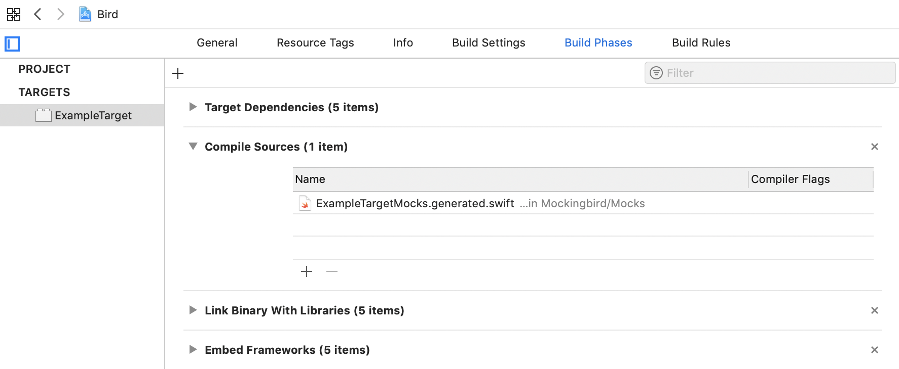

# Mockingbird

[](http://cocoapods.org/pods/Cuckoo)
[](https://github.com/Carthage/Carthage)
[](https://swift.org/package-manager/)
[](https://github.com/birdrides/mockingbird/blob/master/LICENSE)

Mockingbird is a convenient mocking framework for Swift.

```swift
// Mocking
let bird = mock(Bird.self)

// Stubbing
given(bird.getCanFly()) ~> true

// Verification
verify(bird.fly()).wasCalled()
```

---

## Installation

Mockingbird comes in two parts, both of which should be installed:

1. The **Mockingbird Framework** provides functions for mocking, stubbing, and verification in tests.
2. The **Mockingbird CLI** generates mocks.

### CocoaPods

Add the framework to a test target in your `Podfile`.

```ruby
target 'ATestTarget' do
  pod 'Mockingbird', '~> 0.3.0'
end
```

This will download and install the CLI during the next `pod install`.

### Carthage

Add the framework to your `Cartfile`.

```
github "birdrides/mockingbird" ~> 0.3.0
```

And set up Carthage to only build the framework when running `carthage update`.

```bash
$ carthage update --no-build
$ cd Carthage/Checkouts/Mockingbird
$ make bootstrap-carthage
```

Then download and install the CLI.

```bash
$ make install-prebuilt
```

### Swift Package Manager

Add the framework as a package and test target dependency in your `Package.swift` file.

```swift
dependencies: [
  .package(url: "https://github.com/birdrides/mockingbird.git", .upToNextMajor(from: "0.3.0"))
],
targets: [
  .testTarget(
    name: "ATestTarget",
    dependencies: [
      "Mockingbird"
    ]
  )
]
```

Then download and install the CLI.

```bash
$ swift package update
$ cd .build/checkouts/Mockingbird
$ make install-prebuilt
```

### From Source

Clone the repository and build the `MockingbirdFramework` scheme for the desired platform. Drag the built 
`Mockingbird.framework` product into your project and link the library.

```bash
$ git clone https://github.com/birdrides/mockingbird.git
$ cd mockingbird
$ open Mockingbird.xcodeproj
```

Then build and install the CLI.

```bash
$ make install
```

## Setup

Mockingbird generates mocks using the `mockingbird` command line tool which can be integrated into your
build process in many different ways.

### Automatic Integration

The Mockingbird CLI can automatically add a build step to generate mocks in the background whenever the 
specified targets are compiled.

```bash
$ mockingbird install --project <xcodeproj_path> --targets <target_names>
```

### Manual Integration

Add a Run Script Phase to each target that should generate mocks. 

```bash
mockingbird generate &
```

Remove the trailing `&` if mocks should generate synchronously when building the target. This may increase build 
times by a few seconds. See [Mockingbird CLI - Generate](#generate) for available generator options.

### Importing Mocks

By default, Mockingbird will generate target mocks into `Mockingbird/Mocks/` under the project’s source root 
directory. (Specify a custom location to generate mocks for each target using the `outputs` CLI option.)

Unit test targets that import a module with generated mocks should include the mocks file under Build Phases → 
Compile Sources.



## Usage

An example demonstrating basic usage of Mockingbird can be found at 
[TreeTests.swift](/MockingbirdTests/Example/TreeTests.swift). 

### Mocking

Mocking lets you create objects which can be passed in place of the original type. Generated mock types are 
always suffixed with `Mock`.

```swift
let bird = mock(Bird.self)  // Returns a `BirdMock`
```

Class mocks rely on subclassing which has certain limitations, so consider using protocols whenever possible.

```swift
let tree = mock(Tree.self).init(with: bird)  // Returns a `TreeMock`
```

### Stubbing

Stubbing allows you to define a custom value to return when a mocked method is called.

```swift
given(bird.createNest()) ~> Nest()
```

You can use an [argument matcher](#argument-matching) to selectively return results. Stubs added later have 
precedence over those added earlier, so stubs with more generic argument matchers should be added first.

```swift
given(bird.chirp(volume: any())) ~> false    // Matches any volume
given(bird.chirp(volume: notNil())) ~> true  // Matches any non-nil volume
given(bird.chirp(volume: 10)) ~> false       // Matches volume = 10
```

Stub variables with their getter and setter methods.

```swift
given(bird.getName()) ~> "Big Bird"
given(bird.setName(any())) ~> { print($0) }
```

Getters can be stubbed to automatically save and return values.

```swift
given(bird.getName()) ~> lastSetValue(initial: "One")
bird.name = "Two"
assert(bird.name == "Two")
```

It’s possible to stub multiple methods with the same return type in a single call.

```swift
given(
  birdOne.getName(),
  birdTwo.getName()
) ~> "Big Bird"
```

### Verification

Verification lets you assert that a mock received a particular invocation during its lifetime.

```swift
verify(bird.chirp(volume: 50)).wasCalled()
```

It’s possible to verify that an invocation was called a specific number of times with a count matcher.

```swift
verify(bird.getName()).wasNeverCalled()            // n = 0
verify(bird.getName()).wasCalled(exactly(10))      // n = 10
verify(bird.getName()).wasCalled(atLeast(10))      // n ≥ 10
verify(bird.getName()).wasCalled(atMost(10))       // n ≤ 10
verify(bird.getName()).wasCalled(between(5...10))  // 5 ≤ n ≤ 10
```

Count matchers also support chaining and negation using logical operators.

```swift
verify(bird.getName()).wasCalled(not(exactly(10)))           // n ≠ 10
verify(bird.getName()).wasCalled(exactly(10).or(atMost(5)))  // n = 10 || n ≤ 5
```

Sometimes you need to perform custom checks on received parameters by using an argument captor.

```swift
let locationCaptor = ArgumentCaptor<Location>()
verify(bird.fly(to: locationCaptor.matcher)).wasCalled()
assert(locationCaptor.value?.name == "Hawaii")
```

You can test asynchronous code by using an `eventually` block which returns an `XCTestExpectation`. 

```swift
DispatchQueue.main.async {
  Tree(with: bird).shake()
}
let expectation = eventually {
  verify(bird.fly()).wasCalled()
  verify(bird.chirp(volume: 50)).wasCalled()
}
wait(for: [expectation], timeout: 1.0)
```

Verifying doesn’t remove recorded invocations, so it’s safe to call verify multiple times (even if not recommended).

```swift
verify(bird.getName()).wasCalled()  // If this succeeds...
verify(bird.getName()).wasCalled()  // ...this also succeeds
```

For methods overloaded by return type, you should help the compiler by specifying the type returned.

```swift
// Stubbing `getMessage<T>() -> T`
verify(bird.getMessage()).returning(String.self).wasCalled()
```

### Resetting Mocks

Occasionally it’s necessary to remove stubs or clear recorded invocations.

```swift
reset(bird)                 // Removes all stubs and recorded invocations
clearStubs(on: bird)        // Only removes stubs
clearInvocations(on: bird)  // Only removes recorded invocations
```

### Argument Matching

Argument matchers allow wildcard matching of arguments during stubbing or verification.

```swift
any()                    // Matches any value
any(of: 1, 2, 3)         // Matches any value in {1, 2, 3}
any(where: { $0 > 42 })  // Matches any number greater than 42
notNil()                 // Matches any non-nil value
```

For methods overloaded by parameter type (such as with generics), using a matcher may cause ambiguity for 
the compiler. You can help the compiler by specifying an explicit type in the matcher.

```swift
any(Int.self)
any(Int.self, of: 1, 2, 3)
any(Int.self, where: { $0 > 42 })
notNil(String?.self)
```

You can also match elements or keys within collection types.

```swift
any(containing: 1, 2, 3)  // Matches any collection with values {1, 2, 3}
any(keys: "a", "b", "c")  // Matches any dictionary with keys {"a", "b", "c"}
any(count: atMost(42))    // Matches any collection with at most 42 elements
notEmpty()                // Matches any non-empty collection
```

Argument matchers for collections can contain a nested argument matcher.

```swift
// Matches any collection containing a value greater than 42
any(containing: any(where: $0 > 42))

// Matches any dictionary containing a key prefixed with "a"
any(key: any(where: $0.hasPrefix("a")))
```

If you provide a concrete instance instead of an argument matcher, comparisons will use equality and fall back to 
comparing by reference if the parameter type doesn’t conform to `Equatable`.

```swift
bird.chirp(volume: 50)
verify(bird.chirp(volume: 50)).wasCalled()   // Comparing by equality

let bigBird = Bird()
bird.parent = bigBird
verify(bird.setParent(bigBird)).wasCalled()  // Comparing by reference
```

## Mockingbird CLI

### Generate

Generate mocks for a set of targets in a project.

`mockingbird generate` 

| Option | Default Value | Description | 
| --- | --- | --- |
| `--project` | `$PROJECT_FILE_PATH` | Path to your project’s `.xcodeproj` file. |
| `--targets` | `$TARGET_NAME` | List of target names to generate mocks for. |
| `--srcroot` | `$SRCROOT` | The folder containing your project’s source files. |
| `--outputs` | `$MOCKINGBIRD_SRCROOT` | List of mock output file paths for each target. |
| `--preprocessor` | `nil` | Preprocessor expression to wrap all generated mocks in, e.g. `DEBUG`. |

| Flag | Description |
| --- | --- |
| `--disable-module-import` | Omit `@testable import <module>` from generated mocks. |
| `--only-protocols` | Only generate mocks for protocols. |
| `--disable-swiftlint` | Disable all SwiftLint rules in generated mocks. |

### Install

Starts automatically generating mocks by adding a custom Run Script Phase to each target.

`mockingbird install`

| Option | Default Value | Description |
| --- | --- | --- |
| `--project` | *(required)* | Your project’s `.xcodeproj` file. |
| `--targets` | *(required)* | List of target names to install the Run Script Phase. |
| `--srcroot` |  `<project>/../` | The folder containing your project’s source files. |
| `--outputs` | `$MOCKINGBIRD_SRCROOT` | List of mock output file paths for each target. |
| `--preprocessor` | `nil` | Preprocessor expression to wrap all generated mocks in, e.g. `DEBUG`. |

| Flag | Description |
| --- | --- |
| `--reinstall` | Overwrite existing Run Script Phases created by Mockingbird CLI. |
| `--synchronous` | Wait until mock generation completes before compiling target sources. |
| `--only-protocols` | Only generate mocks for protocols. |
| `--disable-swiftlint` | Disable all SwiftLint rules in generated mocks. |

### Uninstall

Stops automatically generating mocks.

`mockingbird uninstall`

| Option | Default Value | Description |
| --- | --- | --- |
| `--project` | *(required)* | Your project’s `.xcodeproj` file. |
| `--targets` | *(required)* | List of target names to uninstall the Run Script Phase. |
| `--srcroot` |  `<project>/../` | The folder containing your project’s source files. |
